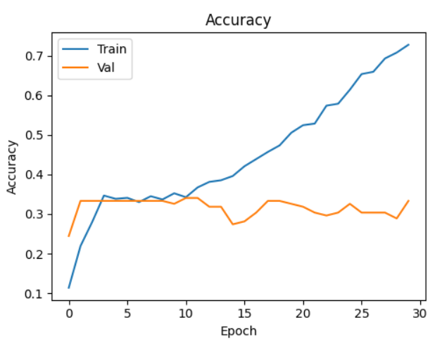

This project is a complete pipeline for detecting the accent of a speaker using audio input, specifically .mp3 files recorded directly from the microphone. It includes data cleaning, feature extraction (MFCC + Chroma + Spectral Contrast + ZCR), CNN model training, prediction, and deployment.

 Project Structure
graphql
Copy
Edit
Accent Detectection/
│
├── cleaned_dataset/              # Cleaned dataset (filtered by sample count)
├── models/
│   └── accent_model.keras        # Trained CNN model
├── label_classes.npy            # Label encoder for accent classes
├── utils/
│   ├── feature_extraction.py    # Audio feature extractor
│   └── dataset_preparation.py   # Dataset cleaner and loader
├── train_model.py               # CNN model training script
├── predict_accent.py           # Real-time voice input prediction
├── requirements.txt             # Dependencies
└── README.md                    # You are here
 Setup Instructions
1.  Install Requirements
bash
Copy
Edit
pip install -r requirements.txt
Contents of requirements.txt:

text
Copy
Edit
librosa
numpy
pandas
scikit-learn
matplotlib
tqdm
tensorflow
sounddevice
scipy
pydub
Make sure to also install FFmpeg (for .mp3 to .wav conversion):

Download: https://ffmpeg.org/download.html

Add to system PATH.

2.  Dataset Cleaning
bash
Copy
Edit
python dataset_preparation.py
Filters samples with sufficient count per accent

Organizes files into cleaned_dataset/

3.  Feature Extraction and Model Training
bash
Copy
Edit
python train_model.py
Extracts MFCCs + Chroma + Spectral Contrast + ZCR

Pads/normalizes features

Trains a CNN model

Saves:

Model to models/accent_model.keras

Label encoder to label_classes.npy

4.  Predict Accent from Voice
bash
Copy
Edit
python predict_accent.py
Records 5-second voice clip via microphone

Saves as .mp3 → Converts to .wav

Extracts padded features

Predicts using the trained CNN model

 Speak during the recording prompt to test your accent.

 Outputs
 Model Accuracy & Training Graph

 Confusion Matrix

 Real-time prediction result in terminal

🧠 Features Used
Feature	Description
MFCC	Mel-Frequency Cepstral Coefficients
Chroma	Pitch class profile
Spectral Contrast	Difference in spectral peaks and valleys
ZCR	Zero-Crossing Rate for energy estimation
